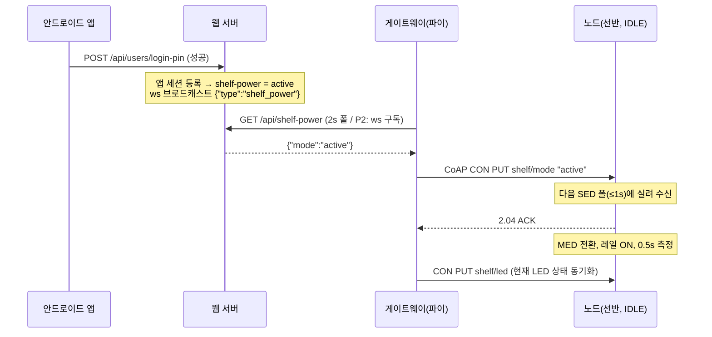
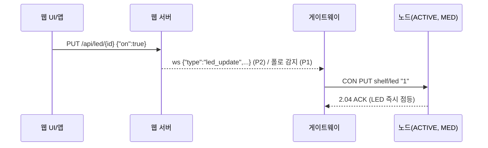
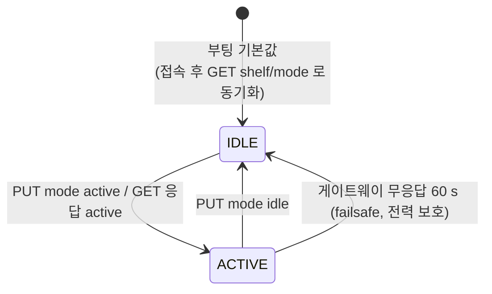

# 전력 모드 설계 — 앱 세션 연동 IDLE / ACTIVE (2026-08-15)

> `agent-prompts/input-0815.md` 요청에 대한 설계안입니다. §10 의 결정 사항으로 리뷰 확정됐습니다.
>
> **구현 현황 (2026-08-15)**: P1 펌웨어(빌드 검증 완료)·P2 게이트웨이·P3 웹·P4 앱·P5 ws 구독까지 코드 구현 완료 (게이트웨이 단위/e2e 42 테스트 통과). 게이트웨이는 서버 `/ws` 를 구독해 로그인/로그아웃·LED 변화에 즉시 반응하고, 2초 폴은 ws 유실·TTL 만료 대비 신뢰성 경로로 유지된다. 남은 것: §9 의 실보드 벤치 검증 4항목.

## 1. 배경과 목표

현재 노드 동작 (코드 기준):

| 항목 | 현재 값 | 출처 |
|---|---|---|
| Thread 역할 | **MED — 수신 상시 ON** (라디오 ~5 mA 상시. 전체 소모의 대부분) | `prj.conf` `OPENTHREAD_MTD_SED=n` |
| LED | **700 ms 주기 CoAP GET 폴링** | `SHELF_LED_POLL_INTERVAL_MS=700` |
| 무게 | `SHELF_MEASURE_INTERVAL_MS`(**Kconfig 기본 10 s**)마다 레일 ON → 측정 → OFF | `Kconfig` (요청문의 "0.5초마다"와 다름 — prj.conf 에 오버라이드 없음) |
| 1회 측정 비용 | 워밍업 300 ms + (버림 3 + 평균 8) × 25 ms(40 Hz) ≈ **레일 ON 575 ms** | `SHELF_LOADCELL_WARMUP_MS` 등 |

사용 패턴: 로그인하면 반입·반출이 연달아 일어나고, 그 외에는 장시간 미사용.

목표 (요청문 그대로):

1. **평상시(IDLE)**: 딥슬립 유지, 1~2초 간격으로 (a) 깨어날지 확인 + (b) 무게 변화 확인
2. **로그인 시(ACTIVE)**: 상시 RX — 서버발 LED 제어를 (웹소켓처럼) **푸시**로 즉시 반영
3. 로그인/로그아웃이 서버 → 게이트웨이 → **전체 노드**로 전파

## 2. 모드 정의

| | **IDLE (평상시)** | **ACTIVE (로그인 중)** |
|---|---|---|
| Thread 링크 모드 | **SED** (rx-off, 데이터 폴 **1 s**) | **MED** (rx 상시 ON) |
| 무게 측정 | **2 s** 간격, 레일 게이트 (40 Hz) | **0.5 s** 간격, **레일 상시 ON** (640 Hz) |
| 무게 보고 | 임계 변화 시 즉시 + **30 s 하트비트** | 임계 변화 시 즉시 + 10 s 하트비트 |
| LED | **강제 소등**, 폴링 없음 | 게이트웨이 **CON 푸시** 수신 + 5 s 동기화 폴(푸시 유실 보험) |
| 전환 신호 | 게이트웨이의 `PUT shelf/mode` 푸시 (다음 데이터 폴에 실려 ≤1 s 내 수신) | 〃 |

- IDLE 의 "1~2초 확인"은 두 갈래로 구현됩니다: **깨어날지 확인 = SED 데이터 폴(1 s, 라디오 수 ms만 ON)**, **무게 확인 = 측정 루프(2 s)**. 각각 Kconfig 로 조정 가능.
- IDLE 에서도 임계 이상 무게 변화는 즉시 보고 → 로그인 없이 물건이 움직여도 DB/로그는 갱신됩니다.

## 3. 핵심 설계 결정

### 3.1 "딥슬립" = Thread SED (nRF System OFF 아님)

System OFF 는 RAM/Thread 세션을 잃고 GPIO/RTC 웨이크 후 **재부팅+재접속(수 초, 라디오 버스트)** 이 필요해서, 1~2초 주기로 깨는 용도에는 오히려 전력이 더 듭니다. SED 는 System ON idle(수 µA) + 라디오만 폴 순간 ON 으로 **Thread 자식 상태를 유지한 채** 평균 수십 µA 급 — 이게 이 클래스 기기의 표준 딥슬립입니다. `firmware/docs/build-and-flash.md` §6 에도 SED 전환 조건이 이미 기록돼 있습니다 (700 ms LED 폴 때문에 보류했던 것 — 이번 설계에서 폴 자체를 없애므로 조건이 해소됨).

### 3.2 깨우기 신호가 잠든 노드에 닿는 원리

노드의 부모는 메시 유일 FTD 인 **파이(리더)** 입니다. Thread 부모는 잠든 자식에게 갈 프레임을 **인다이렉트 큐에 보관**했다가 자식의 데이터 폴에 실어 보냅니다. 따라서 게이트웨이가 `PUT shelf/mode "active"` CON 을 쏘면 **다음 폴(≤1 s) 에 배달**되고, CoAP CON 재전송(2 s × 4회)이 앱 레벨 보험이 됩니다. 노드가 ACK 하지 않으면 게이트웨이가 백오프 재시도합니다.

### 3.3 LED 푸시 — 노드가 CoAP 서버도 겸함

지금 노드는 CoAP 클라이언트 전용입니다. 푸시를 받으려면 노드가 `:5683` 에서 요청도 수신해야 합니다. 소켓 하나를 5683 에 바인드하고 **수신 전담 스레드**가 (a) 내 요청의 응답(토큰 매칭)과 (b) 게이트웨이발 요청(`PUT led/mode` → 처리 + ACK)을 디멀티플렉스합니다. 부수 효과: **푸시 발신지 주소로 게이트웨이를 래치**할 수 있어 멀티캐스트 디스커버리 의존이 줄어듭니다.

### 3.4 "로그인 상태"의 원천 — 서버에 앱 세션 상태 신설

현재 `/api/users/login-pin` 은 **무상태 인증**이라 서버가 "누가 로그인 중인지" 모릅니다. 서버에 인메모리 앱 세션 레지스트리를 신설합니다:

- `login-pin` 성공 시 서버가 내부적으로 세션 등록 (**앱 수정 불필요**)
- 앱 로그아웃 버튼(HomeActivity에 이미 있음) → `POST /api/app-session/leave` 호출 (**앱 수정 1곳**)
- 안전망 TTL 기본 **30분** — 앱이 강제 종료돼 leave 를 못 보내도 선반이 영원히 ACTIVE 로 남지 않음 (30분 × 8.6 mA ≈ 4.3 mAh, 무시 가능)
- 활성 세션 ≥ 1 이면 `mode=active`, 0 이면 `idle` (다중 사용자 refcount)

### 3.5 ACTIVE 의 로드셀 — 레일 상시 ON + 640 Hz

현재 측정 1회가 575 ms 라 0.5 s 주기가 **물리적으로 불가능**합니다. ACTIVE 에서는 (a) 레일을 세션 동안 상시 ON (워밍업 반복 제거 — 짧은 주기에선 껐다켜는 쪽이 오히려 손해), (b) CS1237 을 640 Hz 로 전환(평균 8샘플 = 12.5 ms) → 0.5 s 주기 여유. 640 Hz 는 샘플 노이즈가 커지므로 평균 샘플 수 상향과 임계값 재검이 개발 항목입니다. IDLE 은 지금처럼 게이트 + 40 Hz 유지.

## 4. 종단 시나리오

### 로그인 → 전체 웨이크

웨이크 종단 지연 예산: 세션 감지(폴 ≤2 s / ws ≈0) + 푸시 배달(≤1 s) + 링크모드 전환(수백 ms) = **일반 ~2 s, 최악 ~3.5 s**.

### ACTIVE 중 LED 제어 (즉시 반영)

LED 반영 지연: 현재 0.7~1.7 s → **P1(폴 감지) ≤1 s, P2(ws) 수백 ms**.

### 노드 상태 기계

- 부팅: IDLE 로 시작(안전측) → Thread 접속 후 `GET shelf/mode?id=` 백오프 재시도(2/4/8…60 s 상한)로 동기화. 그동안에도 측정·보고는 정상.
- 게이트웨이는 무게 보고의 `md` 필드로 노드 모드를 보고, 세션 상태와 불일치하면 교정 푸시 → **웨이크를 놓친 노드도 첫 보고(≤30 s 하트비트) 시점에 회복**.

## 5. 프로토콜 변경

### CoAP (노드 ↔ 게이트웨이)

| 방향 | 리소스 | 타입 | 변경 |
|---|---|---|---|
| 노드→GW | `POST shelf/weight` `{"id","seq","raw","mg","mv","md"}` | NON | **`"md":"a"/"i"` 추가** (모드 검증·교정용) |
| 노드→GW | `GET shelf/led?id=` | CON | 유지 — ACTIVE 5 s 동기화 + 구버전 호환. **700 ms 폴은 폐지** |
| 노드→GW | `GET shelf/mode?id=` | CON | **신설** — 부팅/재접속 시 현재 모드 질의 (응답 "active"/"idle") |
| GW→노드 | `PUT shelf/led` "1"/"0" | CON | **신설** — ACTIVE 노드에 즉시 푸시 |
| GW→노드 | `PUT shelf/mode` "active"/"idle" | CON | **신설** — 세션 전환 시 전 노드 푸시, ACK 미수신 시 백오프 재시도 |

### HTTP / WebSocket (게이트웨이 ↔ 웹 서버)

| 항목 | 변경 |
|---|---|
| `GET /api/shelf-power` → `{"mode","ttl_s"}` | **신설**. 게이트웨이 2 s 폴 (P1). **404 면 active 로 간주** → 구버전 웹서버와 물리면 기존 동작 그대로 |
| `POST /api/app-session/enter` / `leave` | **신설**. enter 는 `login-pin` 성공 시 서버 내부 호출, leave 는 앱 로그아웃에서 호출 |
| `/ws` 이벤트 `{"type":"shelf_power","mode":...}` | **신설** (P2: 게이트웨이가 ws 클라이언트로 구독, 끊기면 폴 폴백) |
| `/ws` 이벤트 `led_update` (기존) | P2 에서 게이트웨이도 구독 → LED 푸시 트리거 |
| `GET /api/led/{id}` (기존, mark_seen 하트비트 겸용) | 유지 — 게이트웨이의 서버측 LED 캐시/하트비트 프록시 경로 |

## 6. 컴포넌트별 변경 사항

### 6.1 firmware

| 파일 | 내용 |
|---|---|
| `prj.conf` | `CONFIG_OPENTHREAD_MTD_SED=y` |
| `Kconfig` | 신설: `SHELF_IDLE_POLL_PERIOD_MS`(1000) · `SHELF_IDLE_MEASURE_INTERVAL_MS`(2000) · `SHELF_ACTIVE_MEASURE_INTERVAL_MS`(500) · `SHELF_MODE_SYNC_INTERVAL_MS`(5000) · `SHELF_ACTIVE_FAILSAFE_S`(60) · 하트비트를 **횟수→초 단위**로 개편(`SHELF_HEARTBEAT_SECONDS`, 모드별 계산) |
| `src/shelf_mode.c/h` **신설** | 상태 기계. `otThreadSetLinkMode()`+`otLinkSetPollPeriod()` 런타임 전환 (openthread_api_mutex 보호), 전환 시 `k_event` 로 측정/LED 스레드 주기 즉시 재조정 |
| `src/shelf_coap.c` | 소켓을 :5683 바인드, **수신 전담 스레드** 신설 — 응답/요청 디멀티플렉스, `PUT led`·`PUT mode` 처리+ACK, 푸시 발신지로 게이트웨이 래치, `GET mode` 클라이언트 추가, weight 페이로드에 `md` |
| `src/main.c` | measure 스레드: 모드별 주기·레일 정책(ACTIVE 상시 ON·640 Hz / IDLE 게이트·40 Hz). led 스레드: 폴 루프 → 푸시 적용 + ACTIVE 5 s 동기화 폴 + failsafe 강등 |
| `src/cs1237.c` | 640 Hz 프로파일 런타임 전환 (config 재기록) |
| 셸 | `shelf mode show\|idle\|active\|auto` (벤치 테스트·강제 오버라이드) |

### 6.2 gateway

| 파일 | 내용 |
|---|---|
| `shelfcoap.py` | **CoAP 클라이언트** 추가: CON 송신 + 재전송(ACK_TIMEOUT 2 s, 4회) + 토큰/MID 매칭 |
| `gateway.py` | **ModeManager**: shelf-power 2 s 폴 → 전환 시 전 노드 `PUT mode`(미ACK 백오프 재시도), `md` 불일치 교정 푸시. `led_update` 시 ACTIVE 노드에 `PUT led`. `GET shelf/mode` 응답. `node_ttl` 모드 인식(IDLE 90 s). (P2) aiohttp ws 구독+재접속+폴 폴백 |
| 테스트 | ModeManager 단위(가짜 시계), 클라이언트 재전송, e2e 확장 (푸시 수신 시나리오) |

### 6.3 web

| 파일 | 내용 |
|---|---|
| `shelf_power.py` **신설** | 앱 세션 refcount + TTL(기본 30분), `mode` 계산, 전환 시 ws 브로드캐스트 |
| `routes/users.py` | `login-pin` 성공 시 `shelf_power.enter(username)` |
| `main.py` | `/api/shelf-power`, `/api/app-session/*` 라우트, ws 이벤트 |
| `device_status.py` | 온라인 판정 창을 모드 인식으로 (IDLE 하트비트 30 s 대비 90 s) |

### 6.4 android-app (최소 수정)

| 파일 | 내용 |
|---|---|
| `HomeActivity.kt` | 로그아웃 확정 시 `POST /api/app-session/leave` 호출 1곳 |

## 7. 전력 추정

가정: 브리지 1 kΩ @3.3 V ≈ 3.3 mA (350 Ω 브리지면 레일 항 ×3 — **실물 확인 필요**), CS1237 0.3 mA, MED 라디오 ≈ 5 mA, SED 폴 1 s ≈ 40 µA (LFRC 보정 포함), LED 소등 기준. 표는 추정이며 실측으로 보정합니다.

| 구성 | 평균 전류 | 2000 mAh 기준 지속 |
|---|---|---|
| **현재** (MED + 10 s 측정) | ~5.2 mA | ~16일 |
| IDLE, 측정 2 s (기본안) | ~1.1 mA | **~76일** |
| IDLE, 측정 5 s | ~0.45 mA | ~185일 |
| IDLE, 측정 2 s + 워밍업 100 ms·버림1/평균4 (검증 필요) | ~0.5 mA | ~166일 |
| ACTIVE (세션 중) | ~8.6 mA | 세션 시간에만 해당 |

IDLE 지배 항은 라디오가 아니라 **로드셀 레일 듀티**입니다 (575 ms/2 s = 29%). 측정 주기와 워밍업 단축이 핵심 튜닝 노브 → 오픈 퀘스천 1.

## 8. 장애·호환 시나리오

| 상황 | 동작 |
|---|---|
| 게이트웨이 다운 (ACTIVE 중) | 5 s 동기화 폴 실패 누적 → **60 s 후 IDLE 자가 강등** (배터리 보호). 게이트웨이 복구 시 `md` 불일치 감지 → 교정 푸시로 복귀 |
| 노드가 웨이크 푸시를 놓침 (재부팅 등) | IDLE 하트비트(≤30 s) 보고의 `md:"i"` 를 게이트웨이가 감지 → 교정 푸시 |
| 구펌웨어 + 신게이트웨이 | 노드는 700 ms 폴 지속, 게이트웨이는 폴 응답 유지 → **기존 동작 그대로** (푸시는 무응답 후 포기) |
| 신펌웨어 + 구게이트웨이 | `GET mode` 4.04 → IDLE 유지, 무게 보고는 정상. 절전은 되지만 웨이크 없음 (과도기 조합, 권장 안 함) |
| 신게이트웨이 + 구웹서버 | `/api/shelf-power` 404 → **active 간주** → 절전 도입 전과 동일 동작 |
| USB 연결 (개발/상전원) | 모드 로직 동일, USB 연결 중엔 전력 무관·셸 정상 (VBUS 시 HFCLK 상시라 절전 의미 없음) |

## 9. 개발 단계와 검증 계획

| 단계 | 내용 | 완료 기준 |
|---|---|---|
| **P1 펌웨어** | shelf_mode + coap 수신 스레드 + 모드별 측정/LED + 셸 | 벤치: 런타임 SED↔MED 전환 유지, IDLE 푸시 배달 ≤1 s, `shelf mode` 강제 전환 동작 |
| **P2 게이트웨이** | ModeManager + CoAP 클라이언트 + led 푸시 (세션 감지는 2 s 폴) | 단위 테스트 + 실보드 웨이크/슬립 왕복 |
| **P3 웹** | shelf_power + 라우트 + login-pin 훅 + ws 이벤트 | 로그인→GET shelf-power=active, TTL 만료 동작 |
| **P4 앱** | 로그아웃 leave 호출 | 로그아웃→2 s 내 idle 전환 |
| **P5 통합·ws** | 게이트웨이 ws 구독(P2 경로), e2e, README/프로토콜 표 갱신 | 로그인→웨이크 ≤3.5 s, LED 푸시 ≤0.5 s 실측 |

벤치 검증 항목 (P1 리스크 소거):
1. `otThreadSetLinkMode` 런타임 전환 시 재접속 없이 자식 유지되는지 (`ot pollperiod`, 파이 child table)
2. RC 오실레이터(500 ppm)에서 SED 폴 장시간 안정성 (수 시간 soak, 폴 미스율)
3. 640 Hz 노이즈 → `SHELF_ADC_DELTA_THRESHOLD` 재검 (현재 2500 은 40 Hz 기준 실측)
4. IDLE 전류 실측 (USB 전류계 또는 배터리 지속일) → §7 표 보정

## 10. 리뷰 결정 사항 (2026-08-15 확정)

1. **IDLE 무게 측정 주기: 2 s** — 요청 취지 그대로. 워밍업 단축 실험은 병행.
2. **로그아웃 신호: 앱 로그아웃 시 API 호출 1곳 + 안전 TTL 30분.**
3. **웨이크 트리거: 앱 PIN 로그인만** (웹 대시보드 로그인은 제외).
4. IDLE 진입 시 LED 강제 소등 (기본안 유지, 이견 없을 시).
5. ACTIVE 무게 0.5 s — 반출 확정 흐름과의 정합은 P5 통합 시 실측 검토.
